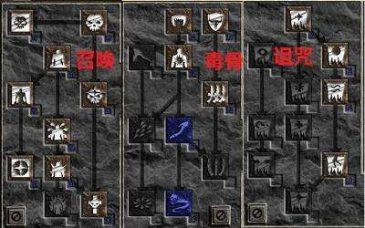
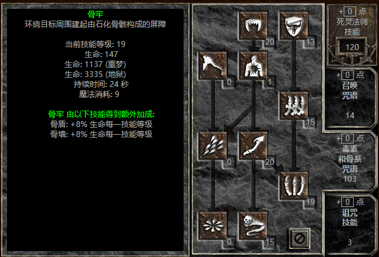

# skill-tree

以技能树的形式介绍我的程序开发能力，并且也是对自己能力的不断调整和警示。

## 简单又长的介绍

我为什么想要写一个这东西呢？主要还是在茫茫多的知识海洋里我会经常迷失自我，别说立个小目标去逐个攻破了，有时候都会出现学着学着都不知道自己会什么了？这一点还真像在学武功，有时候又觉得自己会，又时候又觉得自己什么也不会。

而且常常会被这个学习计划，学习方法，或者说方向而困扰自己，一会学学前端，一会学学后端，一会又学学数据库。为什么会这样呢？

我仔细思考了我自己。有时候自己其实是不了解自己的，因为会有懒惰，欺骗，拖延，等等负面因素来让自己找理由。

想知道为什么，于是我去翻阅了很多资料，其中看到一个观点就是因为我在学习知识没有系统化的学习。而是去零散的，碎片化的，甚至说的获取新鲜感的那种去学习。这样会导致没有形成自己的知识体系，不知道取舍，容易盲目。所以在那段时间，我用了个最简单的办法，读书。把我当下想学的知识的相关书籍我都买回来，一本一本从头到尾看，边看边根据目录记笔记，最后是达到我看到目录就能联想到我的笔记然后再联想到其中的知识点最后甚至可以联想到我写的小例子。

经历过那段时间，我感觉我自己算是真正`入门`了（这里补充一下，我是非科班出现，想学写代码夸张点可以说是一腔热血吧）。

入门之后才发现，我这才算刚刚开始。现在仅仅是会了用语言来做一些简单开发，工作是可以做了，但是按照行话来说就是在糊代码，造屎山。这段时间呢，写的bug比实现的功能要多很多，不过变相的也能让人很快成长。特别是在工作和学习的时候去看别人的博客，学习开源框架的使用，并且来解决实际遇到的问题等等。进步到是挺快，但是有个问题这些都是为了去解决问题或者为了去实现功能而驱动。解决完后就自己一个在那瞎爽，没有进一步的去`思考`这个问题的由来，我们为什么要解决它，解决了能带来什么好处，我又能从中学到什么。而且盲目的去解决问题，到最后这个问题能给自己带来的经验积累性价比不高。

那面对这个问题，我又是如何去解决的呢？问了问老司机，甚至去查看了大学里面的课程安排。我发现前面都是拔苗助长，漏掉了`基础`这一环。计算机的基础是一个很庞大的体系，计算机组成、算法、概论、网络、硬件、数据结构、算法、设计模式等。突然明白前面的问题，基础才是最重要的，基础牢固了才能更好的去解决问题，更适合的去成长。但是这不像当时快速入门编程语言那么轻松了，毕竟当时学scala就那么几本书，现在要来补基础可是一个庞大的体系了，不过没关系硬着头皮慢慢啃了。

可是这个时候呢，我出现了一个我现在才发现并且不知道算不算晚的问题。入门后，有学习能力了编程语言也能快速上手了。我可以遨游在知识的海洋里疯狂学习。不过学着学着经常会因为自己的贪心，而导致学习停止甚至流产。比如我可能补了一段时间的数据结构，过几天又去看了前端js，过几月可能这些都没搞了我又在看设计模式。到最后甚至出现了什么火学什么的地步。这个问题我起初没有意识到，直到我出去面试的时候别人问了我一个问题，“你最擅长什么？”，我突然脑子一片空白，想了想自己好像真没有啥擅长的，我不可能说一个我擅长加班吧？

经历过那次面试之后，我进入了第二次的自我思考。想想自己为什么会这样，问题是出在学习计划上？还是出在工作内容上？还是我不够勤奋？指到我看到一个公众号说到“什么才叫好简历”，比如一个人先是毕业在微软的必应搜索事业部实习，然后转投到了百度开始正式进入搜索领域工作，在百度待了3年后经历了各个搜索相关的项目并且还为开源搜索引擎做出了贡献，目前准备出来到一个新的“搜索领域”公司来做搜索事业部的架构师。这样的经历才能配得上说`擅长`，才能属于“好简历”这个范畴。

回想起我这么些年。ADO.NET拖拉拽开发时代出生，阴差阳错的当了运维做了4、5年的网管，搞弱电，管服务器，调交换机，管机房搞得不亦乐乎。最后代码忘得一干二净，好在linux算半入门。又经过1、2年的苦苦挣扎重学开发，以学习曲线最奇葩，语法糖满天飞的scala重新入门，再次真正入门写代码。当脑子里都快变成写代码模式时，发现自己已经混迹社会6、7年了，与刚才的那个情况一对比，我有时候都不好意思说自己的工作经验。不过好最后这几年跟了一个不错的团队，让我进入了大数据的领域。感觉就像是遇到过无数个渣女之后，经过努力终于找到自己的另一半。

大数据这个领域呢，经过我的理解它其实是一个现象级问题。只是运用以前的技术并做出相应的取舍，并再针对性的强化某些功能来形成新的大数据组件。以前可能就是一个数据库就能解决的问题，现在需要一大堆组件来解决这个问题。应运而生的在大数据领域里就产生了很多职位，比如数据开发，数据平台开发，算法AI，数仓ETL等等。

<补充一些招聘的职业介绍>

继续回想我跟着这个团队近几年所经历的工作，与<补充方向>比较符合。那我准备如何往这个领域发展呢？

## 聊点开发之外的

`暗黑破坏神2`

## 程序员学习路线

https://github.com/hansonwang99/JavaCollection

https://github.com/kamranahmedse/developer-roadmap/blob/master/translations/chinese/readme.md

## 宏观方向

## 怎么学习

记忆与思考

## 学习方法

了解

为什么会出现，解决了什么问题

同行和竞品

使用

各种例子，各种资料，反复系统性锤炼

深入

博客产出，项目产出，轮子产出，教学产出

