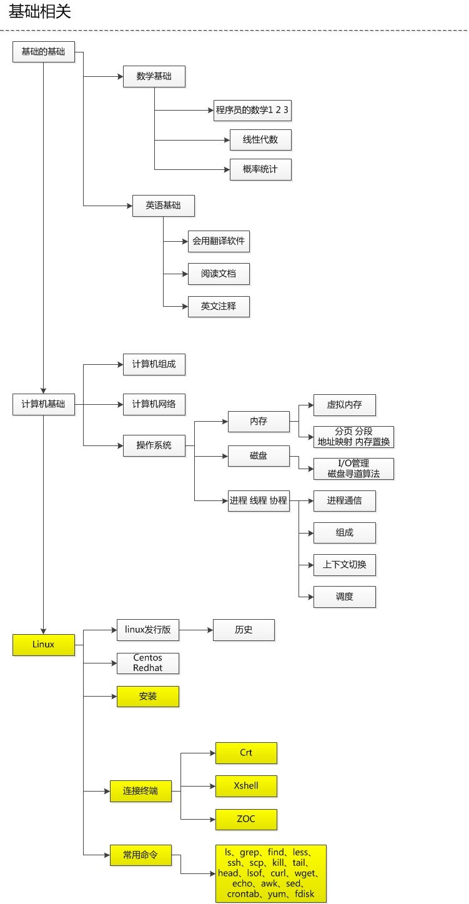
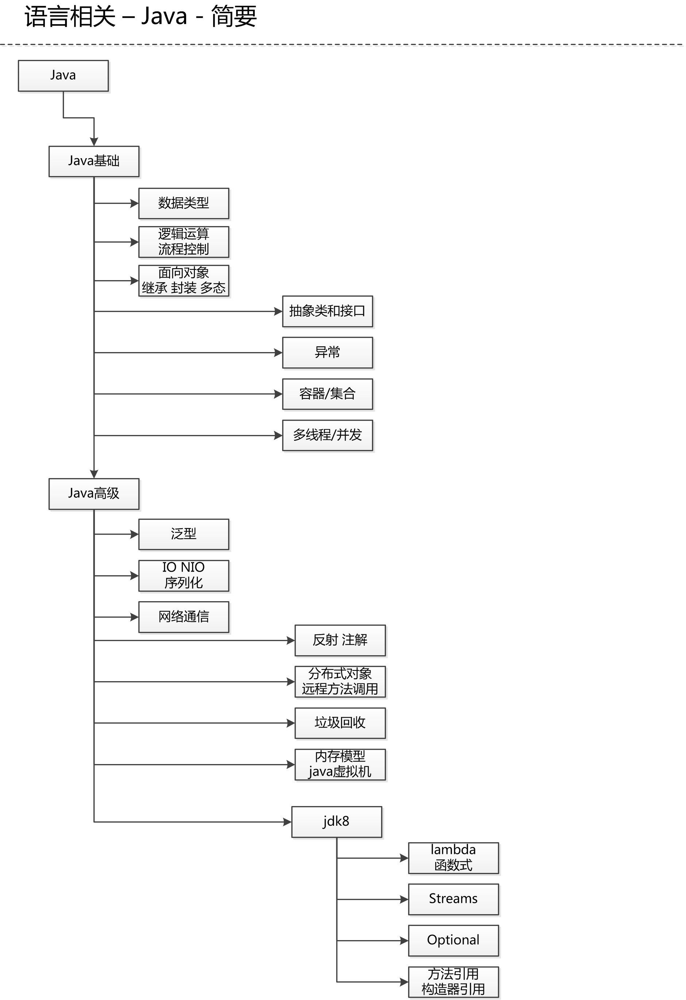

# skill-tree

以技能树的形式介绍我的程序开发能力，并且也是对自己能力的不断调整和警示。

以图的形式规划自己的方向，不让自己“走偏了”！

## 介绍

关于我的技能树介绍以及我为什么要写这个，文字太多我就不在此展示了，[点击阅读](./介绍/README.md)

## 技能树

我的技能树是参考的 https://github.com/kamranahmedse/developer-roadmap/blob/master/translations/chinese/readme.md 进行演变而来的。

主要根据自己多年的摸索进行的调整。

每个人都有自己喜欢的方向，我的不一定你就适合，仅供参考。

有以下几个大方向：

- 基础相关
- 语言相关
- 开发相关
- 运维相关

在下图我会展示我的技能树在这四个方向的熟悉程度，如果想看到详细的，可以点击上面的导航进行查看。

---

## 最后

我们聊聊学习方法和心得，这些也是我查阅了多方资料（书籍、互联网、内容博主、等等）总结出来的。[点击阅读](./学习方法/README.md)

