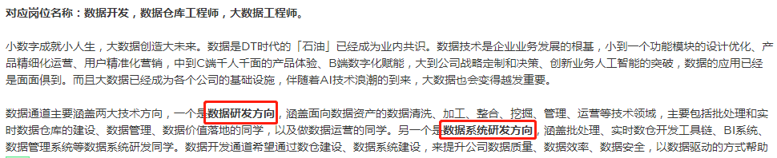
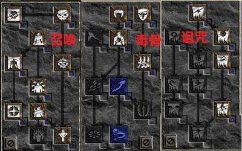
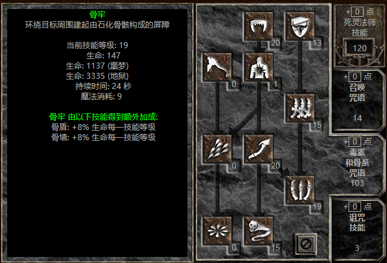

# README

- [返回首页](../README.md)
- [查看技能树](../技能树/README.md)
- [查看学习方法](../学习方法/README.md)

---

## 简单又长的介绍

**入门**

我为什么想要写一个这东西呢？主要还是在茫茫多的知识海洋里我会经常`迷失`自我，别说立个小目标去逐个攻破了，有时候都会出现学着学着都不知道自己会什么了？这一点还真像在学武功，有时候又觉得自己会，又时候又觉得自己什么也不会。

而且常常会被这个学习计划，学习方法，或者说方向而困扰自己，一会学学前端，一会学学后端，一会又学学数据库。为什么会这样呢？

我仔细思考了我自己。有时候自己其实是不了解自己的，因为会有懒惰，欺骗，拖延，等等负面因素来让自己找理由。

想知道为什么，于是我去翻阅了很多资料，其中看到一个观点就是因为我在学习知识没有系统化的学习。而是去零散的，碎片化的，甚至说的获取新鲜感的那种去学习。这样会导致没有形成自己的知识体系，不知道取舍，容易盲目。所以在那段时间，我用了个最简单的办法，读书。把我当下想学的知识的相关书籍我都买回来，一本一本从头到尾看，边看边根据目录记笔记，最后是达到我看到目录就能联想到我的笔记然后再联想到其中的知识点最后甚至可以联想到我写的小例子。

经历过那段时间，我感觉我自己算是真正`入门`了（这里补充一下，我是非科班出现，想学写代码夸张点可以说是凭着一腔热血吧）。

**混乱**

入门之后才发现，我这才算刚刚开始。现在仅仅是会了用语言来做一些简单开发，工作是可以做了，但是按照行话来说就是在糊代码，造屎山。这段时间呢，写的bug比实现的功能要多很多，不过变相的也能让人很快成长。特别是在工作和学习的时候去看别人的博客，学习开源框架的使用，并且来解决实际遇到的问题等等。进步到是挺快，但是有个问题这些都是为了去解决问题或者为了去实现功能而驱动。解决完后就自己一个在那瞎爽，没有进一步的去`思考`这个问题的由来，我们为什么要解决它，解决了能带来什么好处，我又能从中学到什么。而且盲目的去解决问题，到最后这个问题能给自己带来的经验积累性价比不高。

那面对这个问题，我又是如何去解决的呢？问了问老司机，甚至去查看了大学里面的课程安排。我发现前面都是拔苗助长，漏掉了`基础`这一环。计算机的基础是一个很庞大的体系，计算机组成、算法、概论、网络、硬件、数据结构、算法、设计模式等。突然明白前面的问题，基础才是最重要的，基础牢固了才能更好的去解决问题，更适合的去成长。但是这不像当时快速入门编程语言那么轻松了，毕竟当时学scala就那么几本书，现在要来补基础可是一个庞大的体系了，不过没关系硬着头皮慢慢啃了。

可是这个时候呢，我出现了一个我现在才发现并且不知道算不算晚的问题。入门后，有学习能力了编程语言也能快速上手了。我可以遨游在知识的海洋里疯狂学习。不过学着学着经常会因为自己的贪心，而导致学习停止甚至流产。比如我可能补了一段时间的数据结构，过几天又去看了前端js，过几月可能这些都没搞了我又在看设计模式。到最后甚至出现了什么火学什么的地步。这个问题我起初没有意识到，直到我出去面试的时候别人问了我一个问题，“你最擅长什么？”，我突然脑子一片空白，想了想自己好像真没有啥擅长的，我不可能说一个我擅长加班吧？

经历过那次面试之后，我进入了第二次的自我思考。想想自己为什么会这样，问题是出在学习计划上？还是出在工作内容上？还是我不够勤奋？指到我看到一个公众号说到“什么才叫好简历”，比如一个人先是毕业在微软的必应搜索事业部实习，然后转投到了百度开始正式进入搜索领域工作，在百度待了3年后经历了各个搜索相关的项目并且还为开源搜索引擎做出了贡献，目前准备出来到一个新的“搜索领域”公司来做搜索事业部的架构师。这样的经历才能配得上说`擅长`，才能属于“好简历”这个范畴。

**方向**

回想起我这么些年。ADO.NET拖拉拽开发时代出生，阴差阳错的当了运维做了4、5年的网管，搞弱电，管服务器，调交换机，管机房搞得不亦乐乎。最后代码忘得一干二净，好在linux算半入门。又经过1、2年的苦苦挣扎重学开发，以学习曲线最奇葩，语法糖满天飞的scala重新入门，再次真正入门写代码。当脑子里都快变成写代码模式时，发现自己已经混迹社会6、7年了，与刚才的那个情况一对比，我有时候都不好意思说自己的工作经验。不过好最后这几年跟了一个不错的团队，让我进入了大数据的领域。感觉就像是遇到过无数个渣女之后，经过努力终于找到自己的另一半。

大数据这个领域呢，经过我的理解它其实是一个现象级问题。只是运用以前的技术并做出相应的取舍，并再针对性的强化某些功能来形成新的大数据组件。以前可能就是一个数据库就能解决的问题，现在需要一大堆组件来解决这个问题。应运而生的在大数据领域里就产生了很多职位。

比如，我在各大招聘上看到的

继续回想我跟着这个团队近几年所经历的工作，与这`数据系统研发方向`比较符合。但是仔细往下看，会有比如数仓开发工具链、BI系统、数据管理、计算或存储引擎、数据应用系统。等等、茫茫多的职位，茫茫多的关键字。我应该冷静下来思考思考，不能浮躁，我该选择什么方向，然后朝着这个方向深入下去成为这个领域的专家。

在怎么给自己选定方向前，我们先暂停休息下。

## 聊点开发之外的

`暗黑破坏神2`这个游戏我相信大多数人都玩过。这个游戏的职业设计，我认为是在那个时代的RPG里最牛逼的游戏了。

令我着迷的是，他每个角色设计了3个大个技能流派，就像下图这样。并且每个流派里还拆分了2-3类玩法，组合起来一个角色可以体验到至少3-4种职业的玩法。

我当时特别喜欢玩的就是死灵法师，而且还是最费钱的纯骨死灵法师。下面是纯骨死灵法师的加点。

那这个游戏能给选择发展方向带来什么帮助呢？

当时玩暗黑的朋友都知道，那时候互联网不发达，只能靠自己摸索技能乱加点先爽了就行。带来的后果就是后面的难度根本就杀不过，或者杀得不爽，体会不到那个快感。

玩到最后才发现自己加点也不对，技能都点错。在当时怎么办，基本上就是删了角色重新开始练。

从这一点与我实际工作上，学习上也是一样的。要不呢我有个好的老师指引方向，要不就是自己摸索。显然我就是自己摸索瞎学一通的那种。带来的问题就是我好像啥都会一点，啥都不精通。我现在醒悟过来了，不能这样下去，我必须选择一个喜欢的方向深入下去。就像我喜欢玩死灵法师的纯骨流派，那即使烧钱我也会玩下去，因为我喜欢这个流派。

虽然前面我浪费了很多年，去尝试了各种各样的职业，学了乱七八糟各种东西。变相得也让我能认清自己，我以后的发展该学什么，不该学什么。因为我在前面已经都去尝试过了，现在不需要再花时间去尝试了，只需要静下心来坚持我想做的，我就能成功。

## 怎么选择方向呢

**经历**

说了暗黑的技能树，我也知道技术太多太杂不能漂浮在上面，要沉下来（我可是不能删号重练的呀）。那我该如何选择`哪个方向`沉下去呢？

前面有提到过，一个好的经历可以让你在这个方向走得很长远。可是回头看了看我的经历，又乱又杂！怎么办呢？那也要梳理起来，抽丝剥茧的看看我这些经历对我以后会有什么帮助。

我干了很长时间运维，不算前面这些差不多在大数据领域待了也有5年了，并且这些年一直处于`数据平台领域`。主要负责搭建数据平台，让业务用户来使用我提供的数据服务。包括但不限于，数据同步、实时和离线数据服务、计算平台、SQL统一服务、调度平台、集群搭建和升级、监控优化和调参。简单的说就是我没有参与业务，可以说一点业务不懂，我只是按要求把上游数据库的数据搬运过来，然后提供统一的SQL服务（写一套SQL就可以查到所有的数据），让用户以最短的时间获得他们想要的数据。然后在这个阶段不断去优化他们的计算以便于提升用户体验。那此时不懂业务就会出现一些尴尬的地方，比如在数据库优化器领域就有句很经典的话，`再牛逼的优化，也抵挡不住用户错误的使用`。在后续阶段呢，我会去适当的了解与计算相关的业务，来进行定制的优化器开发实现专项效率提升。

虽然看上去我在这个数据平台领域也有很多很杂的事情，好在我从中找到了我`喜欢`并且想一直深入下去的。在这些经历当中做得最多的是`集群监控和调参`，让我最喜欢的呢是`SQL统一服务`或者叫`SQL引擎`。首先，我觉得与运维相关的比如搭建、监控、调参，这些其实是不碍事的技术，或者说是一个基础技术。不管你做什么方向都需要对这个，不说精通了，必须得是熟练。因为开发完一套系统，如果没有完善的运维监控体系，那这个系统基本就是纸糊的一吹就破！接下来就是SQL引擎这个了，首先呢在我了解的范畴当中基本都是以先实现一个`SQL解析器`并将`SQL字符串转换成一颗AST语法树`为入口，获得这个语法树后你可以实现各种各样的计算。比如我们常见的`Hive`就是将语法树转换成了`MapReduce计算`，还有我们在流式处理中的明星`flink`它也有对应的SQL api，将SQL转换成流式计算的算子。而且往后的计算，是一个很深的学科。

由此，我觉得我应该是找到了我`梦寐以求`的方向了。但是还只是算刚刚开了个头，连门都没有入。

**入门**

我该怎么入门呢？

我觉得我应该先过了`解析器`这一关。那我还是继续使用了以前的学习方法，我先把市面上所有的解析器都大概了解了一边。

c/c++系的 lex&yacc，java系的JavaCC和antlr，还有我之前用scala自带scala parser，以及现在一个很特殊的`calcite`。所以在这个阶段，我应该先把这一关给过了。

---

- [返回首页](../README.md)
- [查看技能树](../技能树/README.md)
- [查看学习方法](../学习方法/README.md)