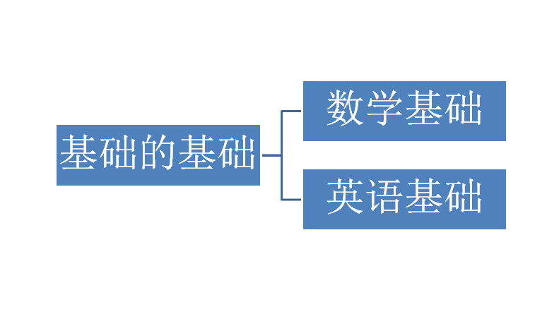
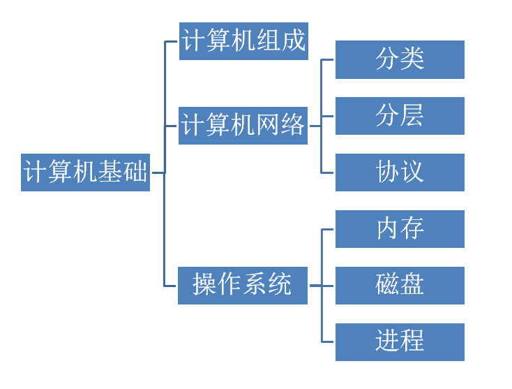
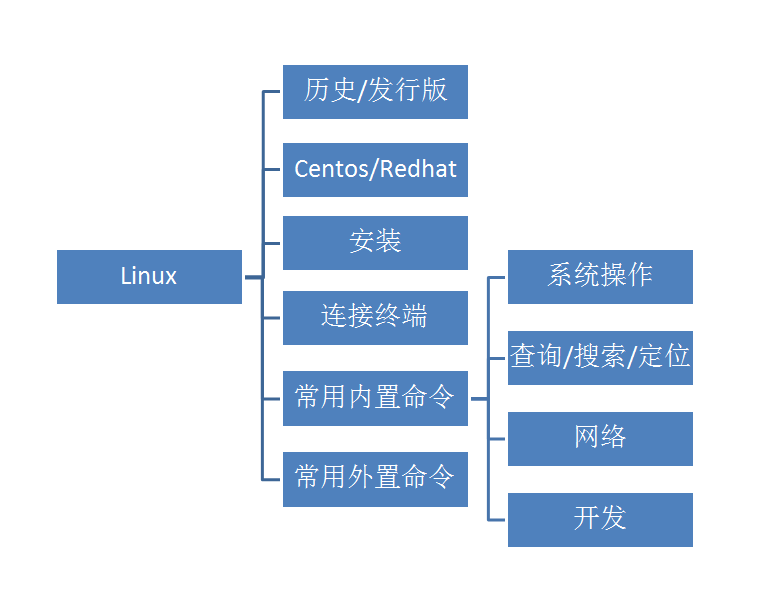

# 基础相关

## 基础的基础

* 基础的基础
    * 数学基础
        * 程序员的数学 1
        * 程序员的数学 2
        * 程序员的数学 3
        * 线性代数
        * 概率统计
    * 英语基础
        * 活用翻译软件
        * 阅读文档
        * 熟练使用英文注释

---

## 计算机基础

- 计算机基础
  - 计算机组成
  - 计算机网络
  - 操作系统
    - 内存
      - 虚拟内存
      - 分页分段
      - 地址映射，内存置换
    - 磁盘
      - I/O 管理
      - 磁盘寻道
    - 进程
      - 进程通信
      - 组成
      - 上下文切换
      - 调度
      - 进程/线程/协程

---

## Linux

- Linux
  - 历史/发行版
  - Centos/Redhat
  - 安装
    - 正常安装
    - 封装镜像自动安装
  - 连接终端
    - crt
    - xshell
    - zoc
  - 常用内置命令
    - 系统操作
      - cd
      - ls
      - yum
      - crontab
      - kill
      - echo
      - ps
      - top
      - watch
      - which/whereis
      - rm/cp
      - file/touch
      - mkdir
      - chown/chmod/chgrp
      - cat
      - time
      - du
      - df
    - 查询/搜索/定位
      - grep
      - find
      - tail/head/more/less
    - 网络
      - ssh
      - scp
      - netstat
      - wget
      - curl
      - ethtool
    - 开发
      - bash
      - awk/sed
  - 常用外置命令
    - htop
    - lsof
    - lsb
    - vim
    - nethogs
    - iptraf
    - ifstat

