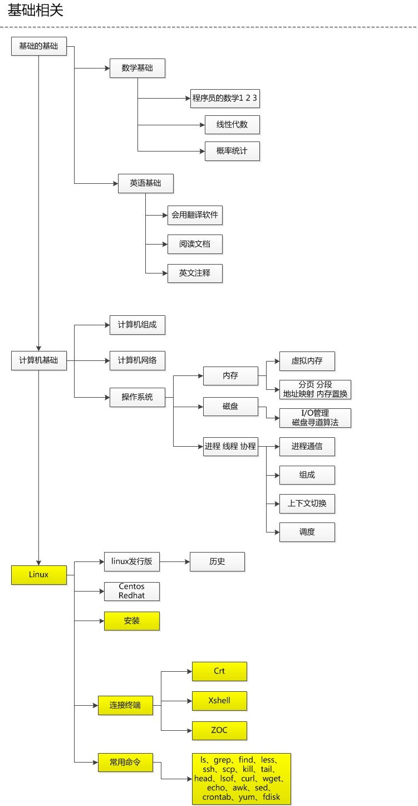
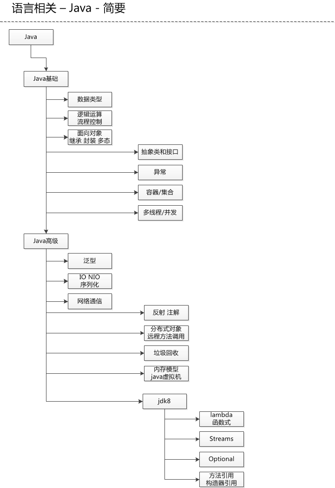

# 技能树 v1.0

我的技能树是参考的 https://github.com/kamranahmedse/developer-roadmap/blob/master/translations/chinese/readme.md 进行演变而来的。

主要根据自己多年的摸索进行的调整。

每个人都有自己喜欢的方向，我的不一定你就适合，仅供参考。

有以下几个大方向：

- 基础相关
- 语言相关
- 开发相关
- 运维相关

在下图我会展示我的技能树在这四个方向的熟悉程度，如果想看到详细的，可以点击上面的导航进行查看。

---

