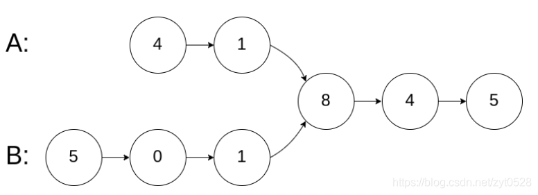
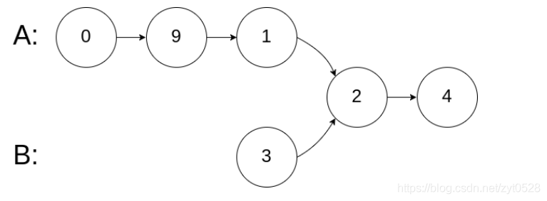
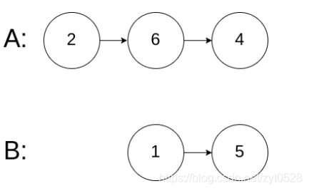

# 两个单链表相交系列问题

[返回目录](../01-数据结构与算法.md)

---

## 第一种问题，如果两个单链表产生了相交，找到相交的起始结点

示例 1：

输入：intersectVal = 8, listA = [4,1,8,4,5], listB = [5,0,1,8,4,5], skipA = 2, skipB = 3
输出：Reference of the node with value = 8
输入解释：相交节点的值为 8 （注意，如果两个链表相交则不能为 0）。从各自的表头开始算起，链表 A 为 [4,1,8,4,5]，链表 B 为 [5,0,1,8,4,5]。在 A 中，相交节点前有 2 个节点；在 B 中，相交节点前有 3 个节点。

对应的效果图




示例 2：

输入：intersectVal = 2, listA = [0,9,1,2,4], listB = [3,2,4], skipA = 3, skipB = 1
输出：Reference of the node with value = 2
输入解释：相交节点的值为 2 （注意，如果两个链表相交则不能为 0）。从各自的表头开始算起，链表 A 为 [0,9,1,2,4]，链表 B 为 [3,2,4]。在 A 中，相交节点前有 3 个节点；在 B 中，相交节点前有 1 个节点。

对应的效果图




示例 3：

输入：intersectVal = 0, listA = [2,6,4], listB = [1,5], skipA = 3, skipB = 2
输出：null
输入解释：从各自的表头开始算起，链表 A 为 [2,6,4]，链表 B 为 [1,5]。由于这两个链表不相交，所以 intersectVal 必须为 0，而 skipA 和 skipB 可以是任意值。
解释：这两个链表不相交，因此返回 null。



注意：

如果两个链表没有交点，返回 null.
在返回结果后，两个链表仍须保持原有的结构。
可假定整个链表结构中没有循环。
程序尽量满足 O(n) 时间复杂度，且仅用 O(1) 内存。


解题思路

求两个单链表的长度，计算两个单链表的长度的差值 x，让长的单链表的指针先走 x 步，然后两个链表的指针同时一人一步走。当两个指针相遇并且两个指针都不为空的时候，两个指针指向的就是相交节点，否则就返回 null


```java
/**
 * Definition for singly-linked list.
 * public class ListNode {
 *     int val;
 *     ListNode next;
 *     ListNode(int x) {
 *         val = x;
 *         next = null;
 *     }
 * }
 */
public class Solution {

    public ListNode getIntersectionNode(ListNode headA, ListNode headB) {

        int len1 = 0;
        int len2 = 0;
        ListNode ps = headA;
        ListNode pl = headB;

        // 计算两个链表的长度
        while (ps != null){
            len1++;
            ps = ps.next;
        }
        while (pl != null){
            len2++;
            pl = pl.next;
        }

        // 比较谁最长，然后再将两个链表重置到初始位
        int x = 0;
        if (len1 > len2) {
            x = len1 - len2;
            pl = headA;
            ps = headB;
        } else {
            x = len2 - len1;
            pl = headB;
            ps = headA;
        }

        // 如果两个链表长短不一，则先开始遍历
        while (x > 0) {
            pl = pl.next;
            x--;
        }
        // 两个链表开始前进，判断2个链表的当前结点是否不相等，或者某个链表已经结束
        while (ps != pl && ps != null && pl != null) {
            pl = pl.next;
            ps = ps.next;
        }
        // A跟B比较，只要相等，返回A或B都能符合结果
        if (pl == ps && pl != null) {
            return pl;
        }

        return null;
    }
}
```
