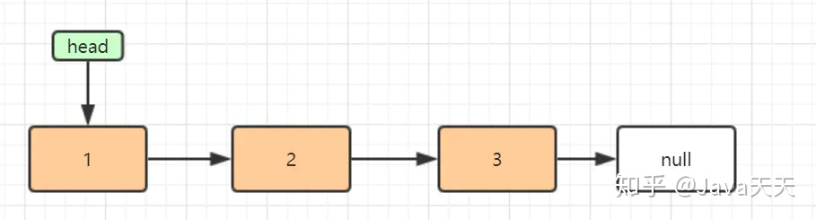
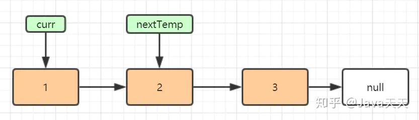
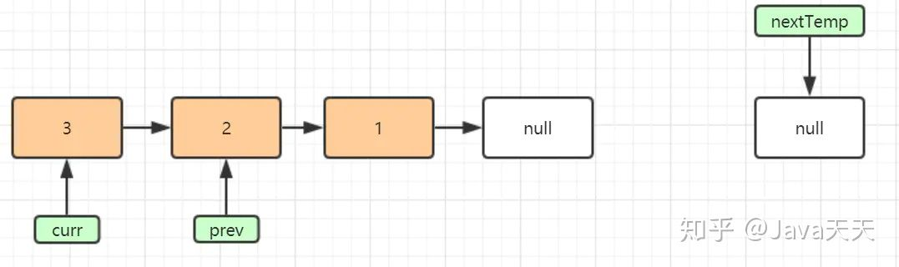

# 单链表翻转

[返回目录](../01-数据结构与算法.md)

---

## 主要思路

在遍历列表时，将当前节点的 next 指针改为指向前一个元素。由于节点没有引用其上一个节点，因此必须事先存储其前一个元素。在更改引用之前，还需要另一个指针来存储下一个节点。不要忘记在最后返回新的头引用！

从头到尾遍历一遍链表，将 `当前节点` 的 `next` 指针指向 `前一个元素`。

必须实现存好上一个元素。

变更指针时，还需要存储下一个节点。

在最后返回新的头。

另一个的思路解释

翻转单链表是我感觉比较难的基础题，那么先来屡一下思路：一个节点包含指向下一节点的引用，翻转的意思就是对要原来指向下一个节点引用指向上一个节点

找到当前要反转的节点的下一个节点并用变量保存因为下一次要反转的是它
然后让当前节点的 next 指向上一个节点， 上一个节点初始 null 因为头结点的翻转后变为尾节点
当前要反转的节点变成了下一个要比较元素的上一个节点，用变量保存
当前要比较的节点赋值为之前保存的未翻转前的下一个节点
当前反转的节点为 null 的时候，保存的上一个节点即翻转后的链表头结点

## 常见代码

java

```java
public ListNode reverse(ListNode head) {
    ListNode pre = null;
    ListNode cur = head;
    while (cur != null) {
        ListNode next = cur.next;
        cur.next = pre;
        pre = cur;
        cur = next;
    }
    return pre;
}
```

go

```go
func reverse(head *ListNode) *ListNode {
    cur := head
    var pre *ListNode
    for cur != nil {
        // 语法糖版
        // cur.Next, pre, cur = pre, cur, cur.Next
        // 常规版
        next := cur.Next
        cur.Next = pre
        pre = cur
        cur = next
    }
    return pre
}
```

参考


## 前言

反转链表是程序员必备的基本素养，经常在面试、笔试的过程中出现。一直觉得反转链表实现代码不是很好理解，决定搬leetcode那道经典反转链表题出来，用十多张图去解析它，希望加深大家对链表反转的理解，谢谢阅读。

leetcode的反转链表原题&答案

**题目描述：**反转一个单链表。

```text
输入: 1->2->3->4->5->NULL
输出: 5->4->3->2->1->NULL
```

**分析：**

假设存在链表 1 → 2 → 3 → Ø，我们想要把它改成 Ø ← 1 ← 2 ← 3。

在遍历列表时，将当前节点的 next 指针改为指向前一个元素。由于节点没有引用其上一个节点，因此必须事先存储其前一个元素。在更改引用之前，还需要另一个指针来存储下一个节点。不要忘记在最后返回新的头引用！

```java
public ListNode reverseList(ListNode head) { 

    ListNode prev = null; 
    ListNode curr = head; 
    while (curr != null) { 
        ListNode nextTemp = curr.next;
        curr.next = prev;
        prev = curr;
        curr = nextTemp;
    }
    return prev;
}
```

图解链表反转代码的实现

接下来，我们图解以上代码实现，先对以上实现代码加上行号，如下：

```java
public ListNode reverseList(ListNode head) { //1

    ListNode prev = null;  // 2
    ListNode curr = head;  // 3
    while (curr != null) {  //4
        ListNode nextTemp = curr.next; //5
        curr.next = prev;  // 6
        prev = curr;  //7
        curr = nextTemp; //8
    }
    return prev;  //9
}
```

第一行代码图解

```java
public ListNode reverseList(ListNode head) {  //1
```

我们顺着题目描述意思，假设链表就有1、2、3个元素吧，后面还跟着一个null，又因为输入是ListNode head，所以这个即将要反转的链表如下:



第二行代码图解

```java
ListNode prev = null;  // 2
```

将null赋值给prev，即prev指向null，可得图如下：


第三行代码图解

```java
ListNode curr = head;
```

将链表head赋值给curr，即curr指向head链表，可得图如下：


循环部分代码图解

```java
while (curr != null) { //4
        ListNode nextTemp = curr.next; //5
        curr.next = prev;  // 6
        prev = curr;  //7
        curr = nextTemp; //8
    }
```

循环部分是**链表反转的核心**部分，我们先走一遍循环，图解分析一波。

因为**curr指向了head**，**head不为null**，所以进入循环。**先来看第5行：**

```java
ListNode nextTemp = curr.next; //5
```

把curr.next 赋值给nextTemp变量，即nextTemp 指向curr的下一节点（即节点2），可得图如下：



再执行到第6行：

```java
curr.next = prev;  // 6
```

把prev赋值给curr.next,因为prev初始化化指向null，即curr(节点1)指向了null，链表图解成这样了：


然后我们看执行到第7行

```java
prev = curr;  //7
```

把curr赋值给prev，prev指向curr，图解如下：


接着，我们执行到第8行：

```java
curr = nextTemp; //8
```

把nextTemp赋值给curr，即curr指向nextTemp，图解如下：


至此，第一遍循环执行结束啦，回到循环条件，**curr依旧不为null**，我们继续图解完它。

5-8行代码又执行一遍，依次可得图：

```java
ListNode nextTemp = curr.next; //5
        curr.next = prev;  // 6
        prev = curr;  //7
        curr = nextTemp; //8
```

执行完ListNode nextTemp = curr.next;后：


执行完curr.next = prev;后：


执行完prev = curr;后：


执行完curr = nextTemp;后：


来到这里，发现curr还是不为null，再回到while循环，再执行一遍：

```java
ListNode nextTemp = curr.next; //5
curr.next = prev;  // 6 
prev = curr;  //7
curr = nextTemp; //8
```

依次可得图：




  


  


  

来到这里，我们发现curr已经为null了，可以跳出循环了。这时候prev指向的就是链表的反转呀，所以第9行执行完，反转链表功能实现：

```text
returnprev;  //9
```


