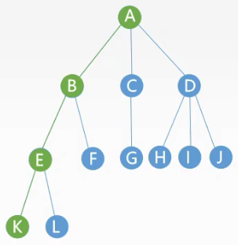
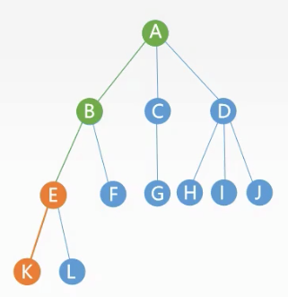
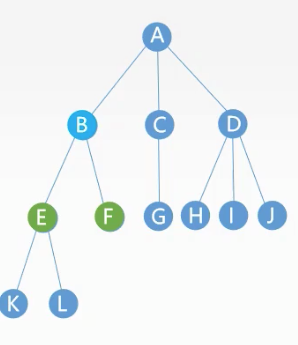

# 树的各种定义

[返回目录](../01-数据结构与算法.md)

---

# 树的概念

树是一种递归的数据结构

除根结点以外,每个结点都有唯一的 前驱结点
每个结点都有0个或多个后继结点
n个结点的树中只有n-1条边

## 根结点

树最顶端的结点,也可以叫初始结点

## 空树 非空树

n是树的结点

n = 0 称为空树

1. 有且仅有一个特定的称为根的节点
2. 当n>1时,其余结点可分为 m (m > 0) 个互不相交的有限集合,其中每一个集合本身又是一棵树,称为根结点的子树


## 子树

```
     A
   / | \
  B  C  D
 / \
E   F
```

* B C D 是以 A 为根的子树
* E F 是以 B 为根的子树

二叉树每个结点的的分支称作该结点的子树，其左侧分支称为左子树，右侧分支称为右子树。

## 祖先结点 和 子孙结点



* A B E 是 K 的祖先结点
* K 是 A B E 的子孙结点

## 双亲结点和孩子结点和兄弟结点



* E 是 K 的双亲结点
* K 是 E 的孩子结点
* L 是 E 的兄弟结点

## 结点的度

树中一个结点的子结点的个数称为度

## 树的度

树中最大度数称为树的度,下图中的树的度为3




## 分支结点

度大于0的结点称为分支结点

## 叶子结点

度为0的结点称为叶子结点

是指没有子节点的节点。

## 结点层次

一个结点的层次直观上来说就是其所在的行，其中根结点层次为1（第一行），其子结点层次为2（第二行），以此类推，第l行的结点为l。

## 结点的高度

自底向上 累加

## 二叉树的深度（高度）

二叉树的深度（高度）指的是二叉树中的最大叶子结点所在的层。
二叉树的深度=max(左子树深度，右子数深度)+1，可用递归的方式实现。

## 结点的深度

自顶向下 累加

## 结点的度

二叉树结点的度指该结点分支的个数，一棵非空二叉树结点的度只有以下三种情况：


## 树的高度

树的高度既深度,是树中结点的最大层数

## 有序树 无序树

有序树是从左到右有序的树

## 路径

树中两个结点之间的路径是由这两个结点之间经过的结点序列构成的

路径一定是自上而下

## 路径长度

经历边的个数

## 左右两个子树的高度差

高度就是深度，即二叉树中叶结点的最大层次数，高度差即深度差。
两颗子树的高度差等于1，意思就是他们的深度差为1。
