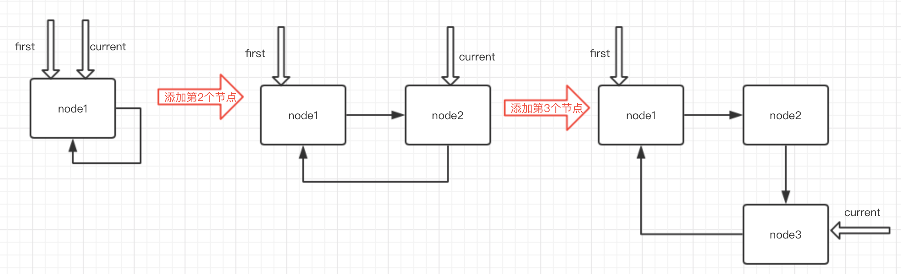
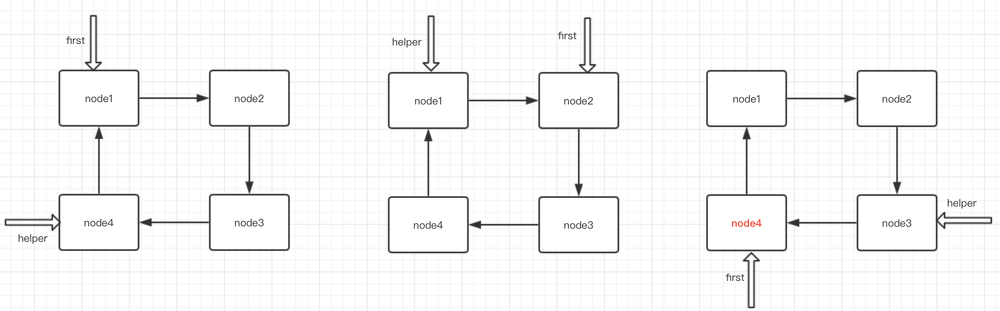
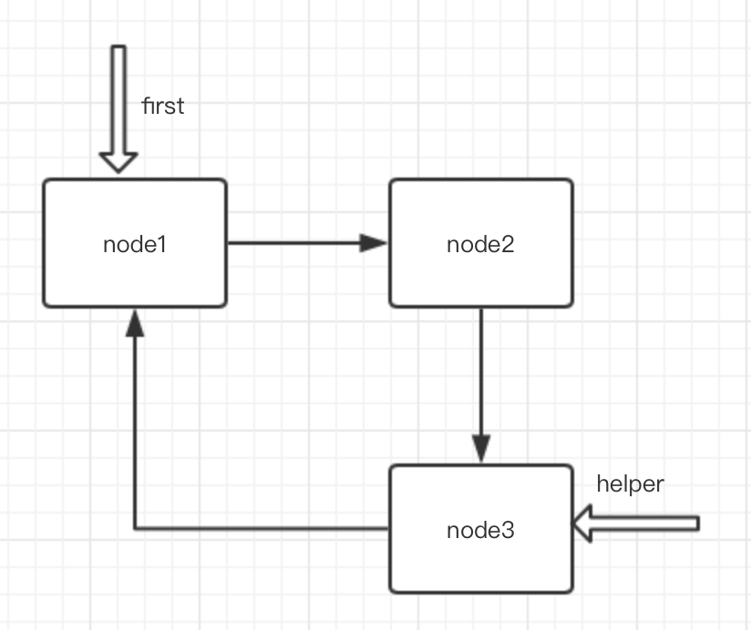
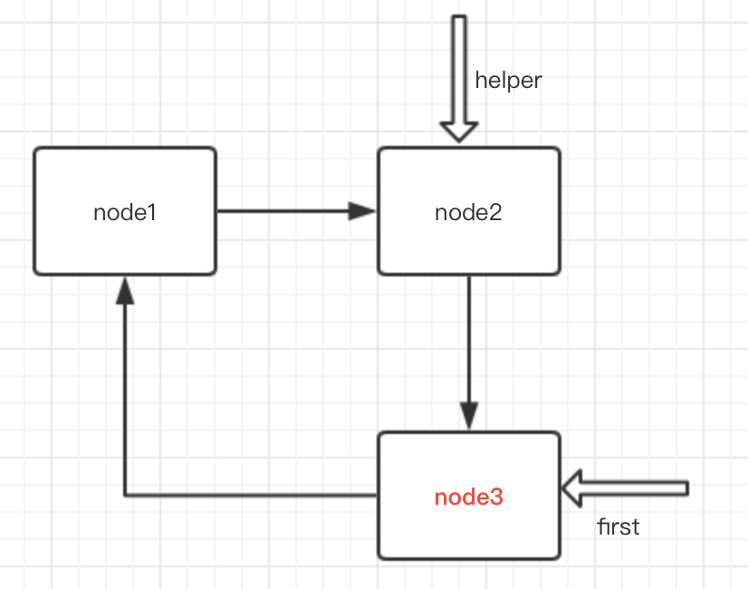

# 约瑟夫问题

[返回目录](../01-数据结构与算法.md)

---

## 典故

据说著名犹太历史学家 约瑟夫有过以下的故事：

在罗马人占领乔塔帕特后，39 个犹太人与约瑟夫及他的朋友躲到一个洞中，39个犹太人决定宁愿死也不要被敌人抓到，于是决定了一个自杀方式，41个人排成一个圆圈，由第1个人开始报数，每报数到第3人该人就必须自杀，然后再由下一个重新报数，直到所有人都自杀身亡为止。然而约瑟夫 和他的朋友并不想遵从，约瑟夫要他的朋友先假装遵从，他将朋友与自己安排在第16个与第31个位置，于是逃过了这场死亡游戏。

首先从一个人开始，越过k-2个人（因为第一个人已经被越过），并杀掉第k个人。接着，再越过k-1个人，并杀掉第k个人。这个过程沿着圆圈一直进行，直到最终只剩下一个人留下，这个人就可以继续活着。问题是，给定了和，一开始要站在什么地方才能避免被处决？


## 参考一

```java
class CycleSingleLinkedList{

    PersonalNode first = null;

    public void add(int num){
        if (num < 1) { return; }

        PersonalNode curr = null;

        for (int i = 1; i <= num; i++) {
            PersonalNode personalNode = new PersonalNode(i);
            if (i == 1) {
                //添加第一个节点
                first = personalNode;
                curr = first;
                curr.setNext(first);
            } else {
                curr.setNext(personalNode);
                personalNode.setNext(first);
                curr = personalNode;
            }
        }
    }
}

class PersonalNode {
    private int no;

    private PersonalNode next;

    public PersonalNode(int no){ this.no = no; }

    public int getNo() { return no; }

    public void setNo(int no) { this.no = no; }

    public PersonalNode getNext() { return next; }

    public void setNext(PersonalNode next) { this.next = next; }
}
```

下面我们用图例的方式讲解一下添加n个节点的循环链表的流程，当创建第一个节点时，我们让first和current指向第一个节点，并将current的next指向first节点，以此来形成一个循环。当添加第二个节点时，我们将current的next指针指向第二个节点，第二个节点的next指向first，然后将current后移，即current指向第二个节点，以此类推。



现在我们问题的第一步即n个人围坐在一起解决了，下面来实现第二步从第k个人开始数数。第二步比较简单，即让first指针后移k-1次，由此让first指针指向第一个数数的人。但由于first指向的节点需要出圈，这里我们再定义一个helper指针，来指向first指针的前一个节点，即让helper指针首先指向first，依此循环直到helper的next指针等于first(因为是循环链表)。并保持helper指针始终在first指针的前一个节点(只有一个节点时与first指针指向同一个节点)。假设k=2即从第二个人开始数，m=3即数到3的人出圈，如下图所示



找到node4的人出圈，这时让helper的next等于first的next，然后让first等于helper的next，如下图所示



继续从node1开始数，数到3，即node3出圈，此时指针指向情况如下图




node3出圈后，下一个要出圈的为node1，依此循环，直到helper与first指针指向相同节点，即node2为最后一个要出圈的人。代码如下


```
    public void joseph(int n,int k,int m){
        //添加n个人
        add(n);
        //helper指针指向first的前一个节点
        PersonalNode helper = first;
        while (helper.getNext() != first){
            helper = helper.getNext();
        }
        //找到第k个人
        for (int i = 0; i < (k-1); i++) {
            first = first.getNext();
            helper = helper.getNext();
        }
        //数到m的人出圈
        while (true){
            if(helper == first){
                break;
            }
            for (int i = 0; i < (m-1); i++) {
                first = first.getNext();
                helper = helper.getNext();
            }
            System.out.printf("编号为%d的人出圈\n",first.getNo());
            first = first.getNext();
            helper.setNext(first);
        }
        System.out.println("最后出圈的人是："+first.getNo());

    }
```

## 参考二

自定义链表实现

```java
public class YueSeFuList {
  public static void main(String[] args) {
    int count = 41;//申请一个指定长度的链表
    Node n = YueSeFuList.createNodes(count);
    for(int i=0;i<count;i++){
      Node second = n.next;//第2个
      n = n.next.next;//第3个
      System.out.println(n.item);//返回第3个
      second.next = n.next;//让第2个的next指向第4个
      n = n.next;//让第4个作为第1个
    }
  }
  public static Node createNodes(int count){
    Node next = null;
    Node head = new Node<String>("head",null);
    Node last = head;//刚开始头和尾都是同一个元素
    //新元素插入尾部，新元素作为尾
    for(int i=1; i<=count; i++){
      next = new Node<String>("num "+i,null);
      last.next = next;
      last = next;
    }
    last.next = head.next;//最后把尾部元素和插入的第一个元素连起来
    head = head.next;//把刚开始的那个head去掉，让插入的第一个元素作为head，返回出去
    return head;
  }
  private static class Node<E>{
    E item;
    Node<E> next;
    //Node<E> prev;

    Node( E element, Node<E> next) {
      this.item = element;
      this.next = next;
      // this.prev = prev;
    }
  }
}
```

LinkedList实现

```java
public class YueSeFu {

  public static void main(String[] args) {
    List list = new LinkedList<String>();
    //初始化链表
    for(int i=0;i<41;i++){
      int a = i+1;
      list.add("p"+a);
    }

    int i = 0;
    while(list.size() > 2){
      i = i+2;//每次移动2位，如果位置超出链表长度，就从头再来
      if(i>list.size()-1){ // 关键在这里，到LinkedList末尾处了，就重置一下下标，重头开始
        i = i-list.size();
      }
      System.out.println((String)list.remove(i));
    }　　　　　//最后的两个幸存者
    System.out.println(list.get(0));
    System.out.println(list.get(1));
  }
}
```