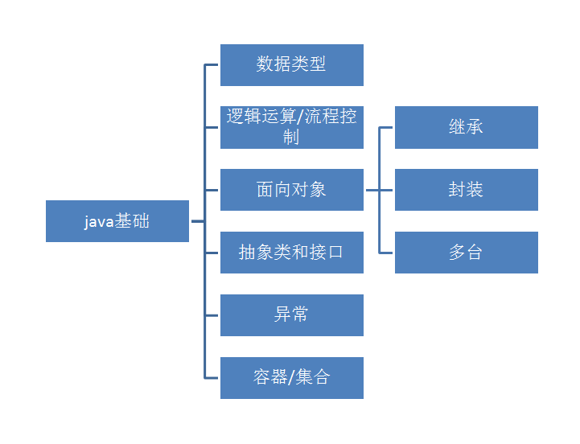
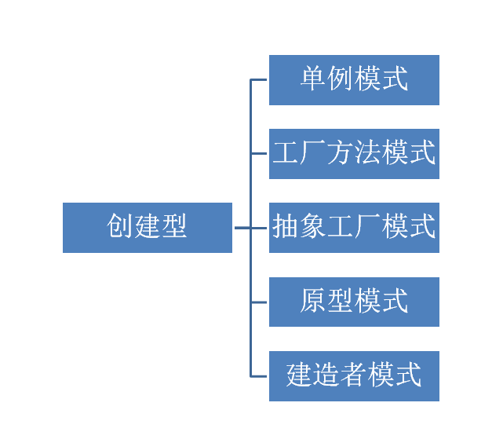
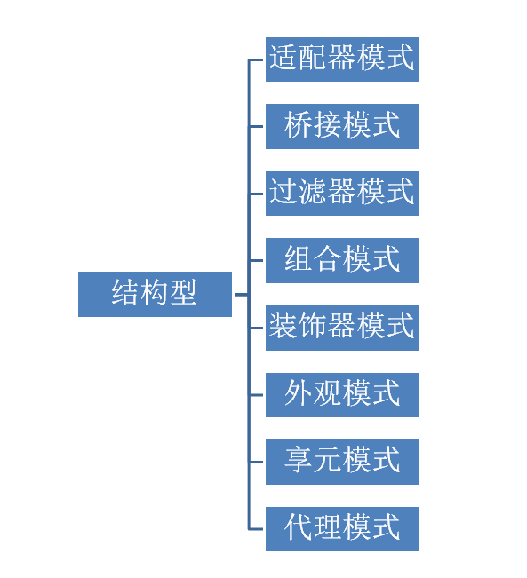
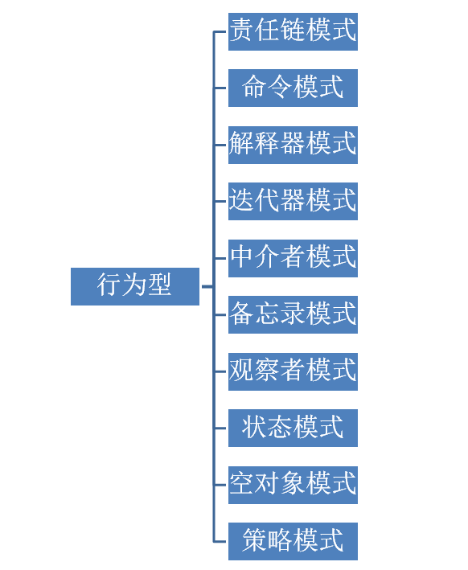
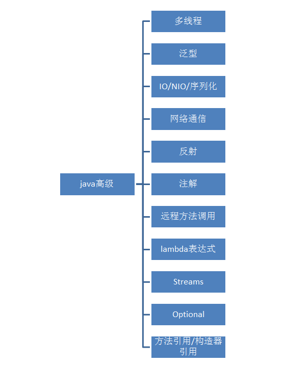

# 语言与开发相关

我认为在语言与开发层面的学习路线应该是这样的，这也是我目前的学习路线；

首先应该学习一门语言的基础（建议以编译型语言为基础），主要包括 `数据类型` `逻辑运算` `流程控制` 这样我们就有了使用编程语言来描述 `程序开发` 这件事的基础；

然后可以继续学习 `面向对象` `接口` `异常`，让我们在开发当中可以考虑到更多的 `容错` `复用`；

接下来，我们可以学习到一门语言内置封装的各种 `容器/集合`，比如java当中经常出现的 `ArrayList` `LinkedList`；

学完以上这些后，我们已经具备了一些简单的 `开发基础`；

这时候我们再去强化 `数据结构` `设计模式` 为后续的开发打下良好的基础；

有了一定 `开发基础` `数据结构` `设计模式` 之后，可以学习一些 `对应语言高级知识` `常用类库` `常用三方类库`；

到这个阶段，已经可以进行一些 `项目` 开发工作了，此时我们可以学习 `常用框架` `其他常用框架或工具` 来锻炼我们的应用开发能力；

学完以上这些，我们可以尝试学习一些其他语言，我因为早期进入了大数据领域，所以多学习了个 `scala`；

后期因为机缘巧合又与 `tidb` 结缘，于是学习了 `go`，此时因为参与开源社区的贡献并将 `git` 知识强化了一波；

最后我们在开发完程序，是需要 `部署/运维` 在操作系统中的，因为我所在的大数据领域都是以linux为基础，所以学习了对linux相关的 `运维` `监控` 知识；

因为我认为，这两方面是一个程序正常运行的前提，你写完代码总需要把程序 `部署运维` 起来，然后在日常中你需要对它不断进行 `监控` 来保证程序的稳定。

## java 基础

* java 基础
  * 数据类型
  * 逻辑运算/流程控制
  * 面向对象
    * 继承
    * 封装
    * 多态
  * 抽象类和接口
  * 异常
  * 容器/集合

## 数据结构

## 设计模式

### 创建型

* 创建型
  * 单例模式
  * 工厂方法模式
  * 抽象工厂模式
  * 原型模式
  * 建造者模式 

### 结构型

* 结构型
  * 适配器模式
  * 桥接模式
  * 过滤器模式
  * 组合模式
  * 装饰器模式
  * 外观模式
  * 享元模式
  * 代理模式

### 行为型

* 行为型
  * 责任链模式
  * 命令模式
  * 解释器模式
  * 迭代器模式
  * 中介者模式
  * 备忘录模式
  * 观察者模式
  * 状态模式
  * 空对象模式
  * 策略模式

## java 高级

* java 高级
  * 多线程
  * 泛型
  * IO/NIO/序列化
  * 网络通信
  * 反射
  * 注解
  * 远程方法调用
  * lambda表达式
  * Streams
  * Optional
  * 方法引用/构造器引用

## java 常用类库

* java常用类库
  * lang
  * applet
  * io
  * net
  * util
  * sql
  * test
  * security
  * beans
  * meth
  * rmi
  * javax
  
## java 常用三方类库

* java 常用三方类库
  * 基础
    * guava
    * commons-lang3
    * commons-io
    * commons-pool2
    * lombok
  * 集合
    * commons-collections
    * google-collections
  * 网络
    * httpclient
  * 时间
    * joda-time
  * 日志
    * logback
    * log4j
    * slf4j
  * json
    * jackson
    * gson
    * fastjson
  * xml
    * dom4j
    * xerces
    * jaxb-api
  * 测试
    * junit
    * testng
    * mockito
  * 序列化
    * protobuf-java

## java 常用框架

* java 常用框架
  * maven
  * sprint boot
  * mybatis/ibatis
  * netty
  * tomcat

## 其他常用框架或工具

* 其他常用框架
  * nginx
  * apache http
  * rsync
  * iptables
  * haproxy
  * lvs
  * keepalive

---

## scala 基础

* scala 基础
  * 数据类型
  * 集合/映射/元组
  * 逻辑控制
  * 模式匹配
  * 面向对象
  * 测试 scalatest
  * 函数式编程
    * 偏函数
    * 纯函数
    * 匿名函数
    * 柯里化
    * 闭包

## scala 高级

* scala 高级
  * actor
  * 定界延续
  * 隐式转换
  * 严格求值/惰性求值
  * 注解/反射
  * 幺半群和单子
  * 类型系统
    * 参数化类型
    * 类型边界
    
---

## go 基础

* go 基础
  * 数据类型
  * 流程控制
  * 异常处理
  * 面向对象
  * 接口组合
  * 包与引入
  * 测试 go test
  * 类型系统
    * 内置类型
    * 引用类型
    * 结构类型

## go 高级

* go 高级
  * 函数/方法/接收者
  * 反射
  * go mod
  * 多线程
    * 协程 goroutine
    * 通道 chan
    * 选择 select
    * 上下文 context
    * 锁
      * 原子函数
      * 互斥锁

---

## git

* git
  * pull
  * push
  * checkout
  * log

---

## 运维

* 运维
  * 操作系统常用配置
  * 环境调整
  * 多机部署与配置 ansible

## 监控

* 监控
  * cacti
  * zabbix
  * nagios
  * prometheus 生态
    * prometheus
    * alertmanager
    * grafana